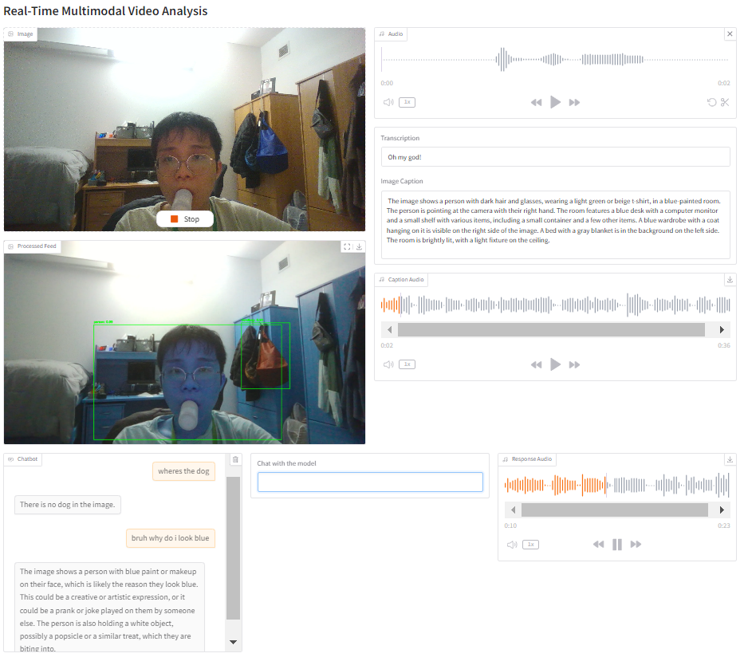

# Multimodal Video Analysis Application

A real-time video analysis application combining object detection, visual language models, and speech processing using Gradio interface.


## Features

- Real-time object detection using Faster R-CNN
- Visual language understanding with Moondream2
- Speech-to-text transcription using Groq Whisper API
- Text-to-speech synthesis using gTTS
- Interactive chat interface with context-aware responses
- Real-time webcam feed with object detection visualization
- Voice recording and transcription
- Automatic image captioning

## Requirements

- Python 3.10+
- CUDA-capable GPU (optional, for faster processing)
- Groq API key
- Webcam for real-time video
- Microphone for audio input

## Installation

1. Clone this repository:
```bash
git clone <repository-url>
cd ProjectCode
```

2. Create and activate a virtual environment:
```bash
python -m venv projectcode
source projectcode/bin/activate  # On Windows: projectcode\Scripts\activate
```

3. Install required packages:
```bash
pip install torch torchvision gradio groq python-dotenv opencv-python gtts sounddevice transformers
```

4. Create a `.env` file with your Groq API key:
```
GROQ_API_KEY=your_api_key_here
```

## Usage

1. Start the application:
```bash
python app.py
```

2. Access the interface:
- Local URL: http://localhost:7860
- Public URL will be provided in the console (expires after 72 hours)

## Features Guide

### Video Analysis
- The webcam feed automatically detects objects in real-time
- Detected objects are highlighted with bounding boxes and labels

### Voice Input
- Click the microphone button to record audio
- Your speech will be transcribed and the current frame will be captioned
- Both transcription and caption will be displayed and read aloud

### Chat Interface
- Type questions about what you see in the video feed
- The model will respond based on the current frame context
- Responses are displayed in the chat and read aloud

## Models Used

- Object Detection: Faster R-CNN with ResNet50 FPN backbone
- Visual Language Model: Moondream2
- Speech-to-Text: Groq Whisper Large V3
- Text-to-Speech: Google Text-to-Speech (gTTS)

## Notes

- Temporary files are automatically cleaned up after processing
- Audio responses autoplay by default
- Chat history is maintained during the session
- For optimal performance, ensure good lighting for the webcam
## Todo
- Test Qwen2.5VL, InternVL, NVIDIA EAGLE
- Test other object  detection models (DETR, Detectron, Faster RCNN, etc)
